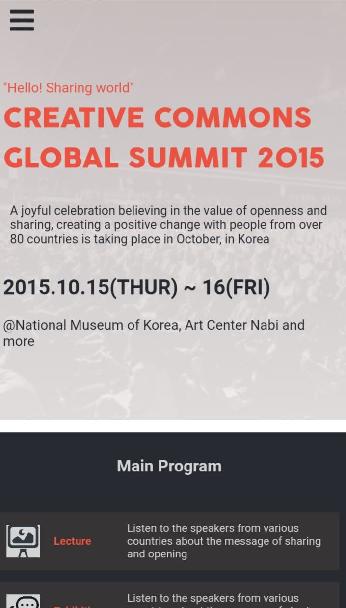

# Conference-page
The project I have built is based on an online website for a conference. The original design idea is by Cindy Shin in Behance. I have personalized the content and made it unique to me. It consists of two pages, the main page and about page.
## Built With

- Html5 and Css3
- Javascript

## Live Demo

Click this [Link](https://lily-coder.github.io/conference-site/) if you want to see the live demo.
- Below are the screenshots of my project:

### Setup
To get a local copy up and running follow these simple example steps.

- Clone the repository to your computer using this [link](https://github.com/lily-coder/conference-site.git)
- Cd into the folder
- Open index.html with live server
- Or you can Fork it instead, and create a pull request to suggest some changes

## Authors

👤 **Lilian Moraa**

- GitHub: [@lily-coder](https://github.com/lily-coder/lily-coder)
- Twitter: [@LilianM53742529](https://mobile.twitter.com/LilianM53742529)
- LinkedIn: [lilian-moraa-99950b1b8](https://www.linkedin.com/in/lilian-moraa-99950b1b8)

## 🤝 Contributing

Contributions, issues, and feature requests are welcome!

Feel free to check the [issues page](../../issues/).

## Show your support

    Please give a⭐️if you love this project.
## Acknowledgments

- To [Cindy Shin](https://www.behance.net/adagio07) for the great idea on Behance.

## 📝 License

This project is [MIT](./MIT.md) licensed.